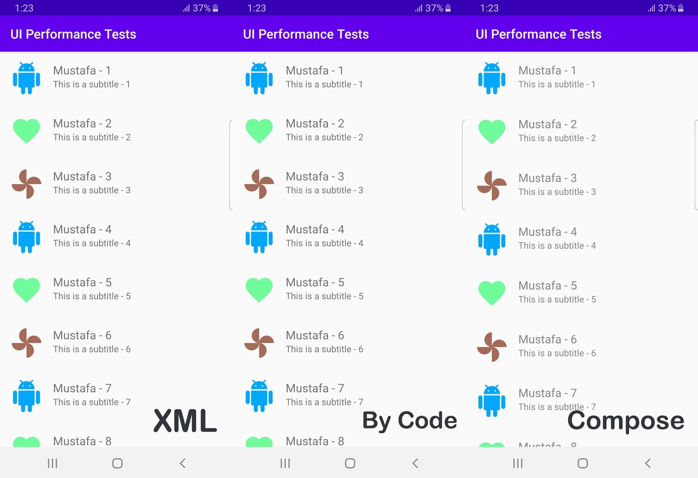

# UI Performance Testes
#### XML vs By code programmatically vs Compose
The app is a simple experiment to compare the performance of activity while creating the layouts in XML, by code programmatically and using the new jetpack compose.

You can check full details [HERE](https://medium.com/@96.mustafa.basim/performance-comparison-building-android-layout-with-xml-vs-by-code-vs-jetpack-compose-17d79bb9952d)

I didn't exactly know how to measure the views creating time so I added multiple stop points to calculate it, you can check the code to see where I added these stop points.

Note: I tested each one alone then close the app then test the other one, no recent apps in the background, no wifi ( in case some app used it and made the CPU busy a bit ).

The environment :
 - Android Studio 4.1 Canary 7
 - Compose version : 0.1.0-dev10
 - Tested on Galaxy S8 ( SM-G950F, Android 9 )  and Huawei Y5 Prime 2018 ( HUAWEI DRA-LX2, Android 8.1 )
 - I tested it in 10 runs for each method.
  ##
*All the numbers are in milliseconds*
#### Benchmarks for  Galaxy S8 ( SM-G950F )  :
| XML  | Min | Max | Average |
|--|--|--|--|
| onCreate | 23 | 72 | 32|
| onResume| 28| 79| 38|
| viewTreeObserver | 147| 331| 204|
| window.decorView| 156| 342| 216|
| onWindowFocusChanged| 196| 405| 256|
  ####
| By Code | Min | Max | Average |
|--|--|--|--|
| onCreate | 23| 69 | 31|
| onResume| 27| 76 | 37|
| viewTreeObserver | 130| 276| 183|
| window.decorView| 136| 285| 194|
| onWindowFocusChanged| 177| 341| 235|
####
| Jetback Compose | Min | Max | Average |
|--|--|--|--|
| onCreate | 31| 141| 42|
| onResume| 35| 148| 48|
| viewTreeObserver | null | null  | null  |
| window.decorView| 176| 681| 265|
| onWindowFocusChanged| 229| 811| 334|

  ##
#### Benchmarks for Huawei Y5 Prime 2018 ( HUAWEI DRA-LX2 )  :
| XML  | Min | Max | Average |
|--|--|--|--|
| onCreate | 64| 138| 75|
| onResume| 77| 156| 91|
| viewTreeObserver | 239| 655| 359|
| window.decorView| 261| 673| 401|
| onWindowFocusChanged| 296| 767| 439|
  ####
| By Code | Min | Max | Average |
|--|--|--|--|
| onCreate | 56| 149| 76|
| onResume| 70| 167| 93|
| viewTreeObserver | 218| 581| 331|
| window.decorView| 242| 680| 367|
| onWindowFocusChanged| 280| 682| 411|
####
| Jetback Compose | Min | Max | Average |
|--|--|--|--|
| onCreate | 71| 183| 89|
| onResume| 86| 201| 107|
| viewTreeObserver | null | null  | null  |
| window.decorView| 453| 1753| 711|
| onWindowFocusChanged| 478| 1754| 763|

  ##
All done with the same identical UI:

